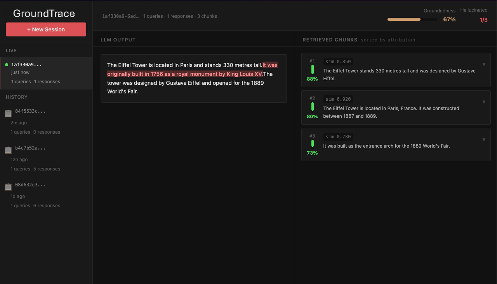

# GroundTrace

GroundTrace is a local RAG tracing dashboard for Python projects. It records retrieval calls, LLM requests, model responses, and sentence-level grounding signals so you can see which retrieved chunks support the answer and which parts look unsupported.




## What It Does

RAG failures are hard to debug when logs only show the final answer. GroundTrace connects the answer back to the retrieved context:

- Captures vector search results from common vector databases.
- Captures LLM prompts, responses, token counts, latency, and rough cost.
- Compares each output sentence with retrieved chunks.
- Marks weakly grounded sentences and shows the most related chunks.
- Streams session updates to a local React dashboard.
- Runs on localhost with no hosted service or account.

## Quick Start

```bash
pip install groundtrace
```

```python
import groundtrace

groundtrace.serve()  # http://127.0.0.1:7756

# Run your existing RAG code normally.
results = collection.query(query_texts=["How does attention work?"], n_results=5)
response = client.chat.completions.create(model="gpt-4o", messages=[...])
```

Open `http://127.0.0.1:7756` while the script runs. The dashboard will show sessions, retrieved chunks, LLM output, grounding score, and per-chunk attribution.

You can also start the server from the command line:

```bash
groundtrace serve
```

## Installation Options

Install the base package for the server, event bus, dashboard API, and grounding pipeline:

```bash
pip install groundtrace
```

Install optional integrations as needed:

```bash
pip install "groundtrace[openai]"
pip install "groundtrace[anthropic]"
pip install "groundtrace[chromadb]"
pip install "groundtrace[pinecone]"
pip install "groundtrace[all]"
```

Python 3.11 or newer is required.

## Supported Integrations

| Integration              | Category    | Capture Coverage                                              |
| ------------------------ | ----------- | ------------------------------------------------------------- |
| OpenAI                   | LLM         | requests, responses, streaming, token metadata when available |
| Anthropic                | LLM         | messages, streaming reconstruction, usage metadata            |
| Gemini                   | LLM         | SDK and transport-level calls                                 |
| HuggingFace Transformers | Local model | generated output and attention-based attribution path         |
| LangChain                | Framework   | chat model calls and retriever results                        |
| ChromaDB                 | Vector DB   | query text, documents, metadata, scores                       |
| Pinecone                 | Vector DB   | matches, metadata, namespace-aware results                    |
| FAISS                    | Vector DB   | local nearest-neighbor results                                |
| Weaviate                 | Vector DB   | object text, metadata, scores                                 |
| pgvector                 | Vector DB   | SQLAlchemy queries using vector operators                     |
| Custom stores            | Manual API  | explicit event recording through `session_bus`                |

## How The Pipeline Works

```text
RAG application
    |
    v
interceptors record retrieval and LLM events
    |
    v
SessionBus stores events per session
    |
    v
background attribution pipeline analyzes responses
    |
    v
FastAPI serves REST and WebSocket updates
    |
    v
React dashboard renders traces and grounding results
```

GroundTrace uses a sentence-transformers model for semantic matching. For each generated sentence, it computes similarity against retrieved chunks. Sentences below the grounding threshold are flagged. For grounded text, the dashboard shows the chunks with the strongest semantic relationship.

Deep attribution is conditional: if a response is already grounded, the pipeline avoids the slower perturbation pass. Local HuggingFace models can use attention rollout; API-backed models can use bounded LIME-style perturbation when requested.

## Common Examples

### OpenAI And ChromaDB

```python
import chromadb
import openai
import groundtrace

groundtrace.serve()

collection = chromadb.Client().get_or_create_collection("docs")
client = openai.OpenAI()

collection.add(
    ids=["a", "b"],
    documents=[
        "Self-attention lets a model compare tokens in the same sequence.",
        "Transformers use stacked attention and feed-forward blocks.",
    ],
)

hits = collection.query(query_texts=["What is self-attention?"], n_results=2)
context = "\n".join(hits["documents"][0])

answer = client.chat.completions.create(
    model="gpt-4o",
    messages=[{"role": "user", "content": f"Context:\n{context}\n\nAnswer the question."}],
)
```

### Manual Vector Store Events

Unsupported retrievers can publish their own events:

```python
from groundtrace.session_bus import bus
from groundtrace.types import RetrievedChunk, VectorQueryEvent

event = VectorQueryEvent(
    db_type="custom",
    collection="knowledge_base",
    query_text=query,
    results=[
        RetrievedChunk(chunk_id=row["id"], text=row["text"], score=row["score"])
        for row in rows
    ],
)
bus.record_vector_query(event)
```

## Public API

### `groundtrace.serve()`

Starts the local server, installs available interceptors, wires the attribution pipeline, and optionally opens the dashboard.

```python
url = groundtrace.serve(
    host="127.0.0.1",
    port=7756,
    open_browser=True,
    auto_intercept=True,
)
```

### `groundtrace.new_session()`

Creates a fresh tracing session and makes it active for subsequent events.

```python
session_id = groundtrace.new_session()
```

### `groundtrace.get_session_url()`

Returns the dashboard URL for the active server, including a session path when an ID is provided.

```python
url = groundtrace.get_session_url(session_id)
```

### `groundtrace.stop()`

Stops the server and restores patched client methods.

```python
groundtrace.stop()
```

## Dashboard Areas

- Session sidebar: live and cached sessions, event counts, recent activity.
- Output panel: response text with sentence-level highlighting.
- Chunks panel: retrieved chunks sorted by attribution score.
- Grounding meter: overall ratio of grounded output.
- Metadata: model name, token counts, latency, and estimated cost when available.

## Testing

Fast tests avoid model downloads:

```bash
python -m pytest tests/ -m "not integration"
```

Integration tests load the real embedding model:

```bash
python -m pytest tests/ -m integration
```

Dashboard build:

```bash
cd dashboard
npm install
npm run build
```

## Security Model

GroundTrace is a local development tool. It binds to localhost by default, keeps session data in memory, and does not send prompts or chunks to a hosted service. Do not expose the dashboard to the public internet without adding your own authentication and network controls.

## Project Layout

```text
groundtrace/                  Python package
  interceptors/              patches for LLM SDKs, frameworks, and vector DBs
  detection/                 sentence-level grounding checks
  attribution/               perturbation and attention attribution
  server/                    FastAPI application and REST endpoints
dashboard/                   React and TypeScript dashboard
examples/                    runnable integration examples
tests/                       unit and integration tests
docs/                        screenshots and demo media
```
